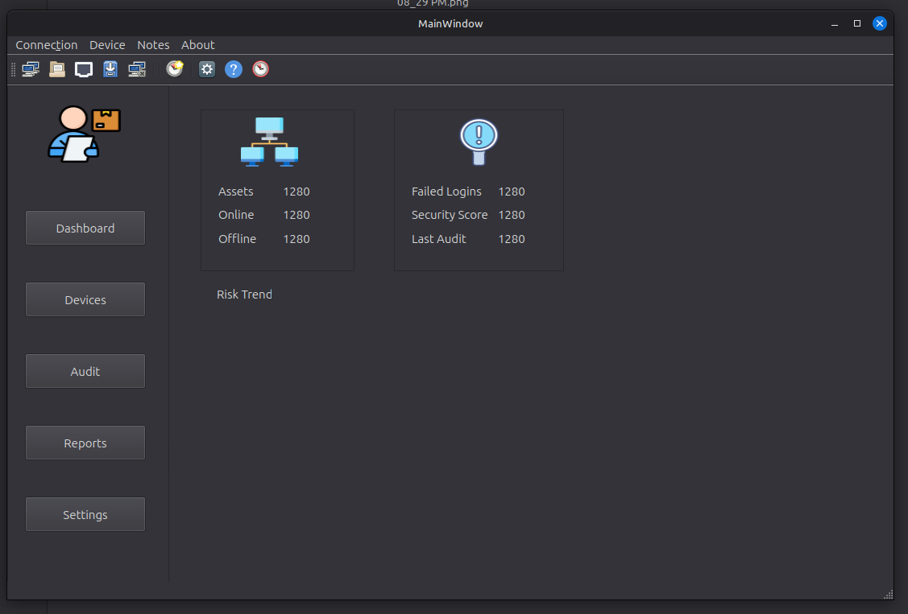

# NetSafe Auditor

A desktop network security auditing application built with Python and PyQt6.

NetSafe Auditor is intended to connect to supported network devices, collect
configuration information, evaluate security controls, and produce clear audit
findings and reports.

> **Project status:** Early development / portfolio project.



## Project Goals

NetSafe Auditor is being developed to provide a structured and understandable
workflow for:

- managing network device connections
- collecting device information
- auditing configurations against defined security checks
- identifying risks and configuration weaknesses
- recording audit results
- producing readable reports
- supporting enterprise and OT network-security learning

The project is designed as a practical bridge between network engineering,
manufacturing engineering, and OT cybersecurity.

## Current Features

- PyQt6 desktop application shell
- Qt Designer user interface
- dashboard, device, audit, report, and settings sections
- device connection form
- reusable resource-path utility
- project structure prepared for audit, network, security, storage, and
  reporting modules

## Planned Features

- Netmiko-based device connectivity
- secure handling of credentials
- Cisco IOS configuration collection
- configurable security-audit rules
- device inventory
- audit history and evidence
- risk scoring
- HTML or PDF reporting
- logging and error handling
- automated tests

## Technology

- Python 3
- PyQt6
- Qt Designer
- Netmiko
- pathlib
- pytest

## Project Structure

```text
netsafe-auditor/
├── main.py
├── requirements.txt
├── media/
│   └── home.png
├── ui/
│   ├── designer/
│   │   ├── main.ui
│   │   └── icons/
│   ├── controllers/
│   ├── models/
│   └── generated/
├── utils/
│   ├── __init__.py
│   └── paths.py
├── core/
├── network/
├── audits/
├── parsers/
├── workers/
├── storage/
├── reporting/
├── security/
└── tests/
```

## Installation

Clone the repository and enter the project directory:

```bash
git clone https://github.com/jablonsky/netsafe-auditor.git
cd netsafe-auditor
```

Create and activate a virtual environment:

```bash
python3 -m venv .venv
source .venv/bin/activate
```

Install the dependencies:

```bash
python -m pip install --upgrade pip
python -m pip install -r requirements.txt
```

Run the application:

```bash
python main.py
```

## Security Notice

Do not commit real device passwords, API tokens, SSH keys, production
configuration files, packet captures, audit evidence, or customer information.

Use environment variables or a secure secrets mechanism for sensitive values.
Sample data included in the repository must be fictional and sanitised.

## Development Approach

This project is intentionally being developed step by step as a learning and
portfolio project. The emphasis is on understandable architecture, traceable
changes, security-conscious engineering, and practical network-auditing
workflows.

## License

A project licence has not yet been selected.
